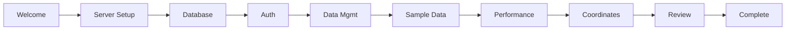

<div align="center">
  
  # istSOS4 Configurator
  
  **The modern way to configure istSOS4 servers**
  
  [](https://nodejs.org/)
  [](https://reactjs.org/)
  [](https://electronjs.org/)
  
</div>

---

# Overview

istSOS4 Configuration Wizard is an **interactive, user-friendly tool** that simplifies the complex process of setting up istSOS4 servers. Generate production-ready Docker configurations through a streamlined, step-by-step interface.

# Installation 

### Prerequisites
- Node.js 18 or higher
- npm or yarn package manager
- Git

## Quick Setup

```bash
git clone https://github.com/istSOS/istSOS4-wizard.git
cd istSOS4-wizard/

npm install
```

---

#  Choose Your Experience

##  Web Version (Browser)
**Perfect for quick configurations and development**

```bash
npm run dev
```
- Access via `http://localhost:5173`

##  Desktop Application
**Native app experience with system integration**

### Development Mode
```bash
npm run electron-dev
```

### Build Standalone Installer
```bash
npm run dist
```

### Download Your Desktop App

| Platform | Installer Location | 
|----------|-------------------| 
|  **Windows** | `dist-electron/win-unpacked/istSOS4 Configurator` | 
|  **macOS** | `dist-electron/mac/istSOS4 Configurator-1.0.0.dmg` |
|  **Linux** | `dist-electron/linux-unpacked/istSOS4 wizard` | 

---

#  Configuration Workflow

<div align="center">

## The Complete Setup in 10 Steps



</div>

| Step | Focus Area | What You Configure |
|------|------------|-------------------|
| **01** |  Welcome | Overview and getting started |
| **02** |  Server Basics | Hostname, ports, API paths |
| **03** |  Database | PostgreSQL connection details |
| **04** |  Authorization | Security and authentication |
| **05** |  Data Management | Versioning, duplicates handling |
| **06** |  Sample Data | Test data generation |
| **07** |  Performance | Redis caching, optimization |
| **08** |  Coordinates | EPSG code configuration |
| **09** |  Review | Validate and preview settings |
| **10** |  Complete | Download and deploy |

---

# Output Files

The wizard generates everything you need for deployment:

<div align="center">

## Generated Configuration

| File | Purpose | 
|------|---------|
| **`.env`** | Environment variables | 
| **`docker-compose.yml`** | Service orchestration | 

</div>

---

#  Deployment

## Quick Deploy (Copy & Paste)

```bash
# Step 1: Get istSOS4
git clone https://github.com/istSOS/istsos4.git
cd istsos4

# Step 2: Replace config files
# (Upload your downloaded .env and docker-compose.yml)

# Step 3: Deploy
docker-compose up -d

# Step 4: Verify
curl http://your-hostname:port/subpath/version/docs
```

##  Development

### Available Commands

```bash
# Web Development
npm run dev              # Start browser-based development
npm run build           # Build web application
npm run preview         # Preview production build

# Desktop Development  
npm run electron-dev     # Desktop app with hot reload
npm run dist            # Create desktop installers

# Platform-specific builds
npm run dist:win        # Windows installer
npm run dist:mac        # macOS DMG
npm run dist:linux      # Linux AppImage
```

## Project Structure

```
istsos4-wizard/
├── 📁 electron/         # Desktop app configuration
├── 📁 src/
│   ├── 📁 components/   # React components
│   ├── 📁 context/      # State management
│   ├── 📁 hooks/        # Custom hooks
│   └── 📁 utils/        # Utilities
├── 📁 public/           # Static assets
└── 📄 package.json      # Dependencies
```

---

<!-- ...existing code... -->


<div align="center">

##  Credits

**Google Summer of Code 2025**

 **[Rahull004](https://github.com/Rahull004)** - *Developer*

**Made with ❤️**

</div>
